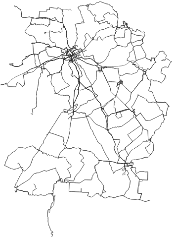
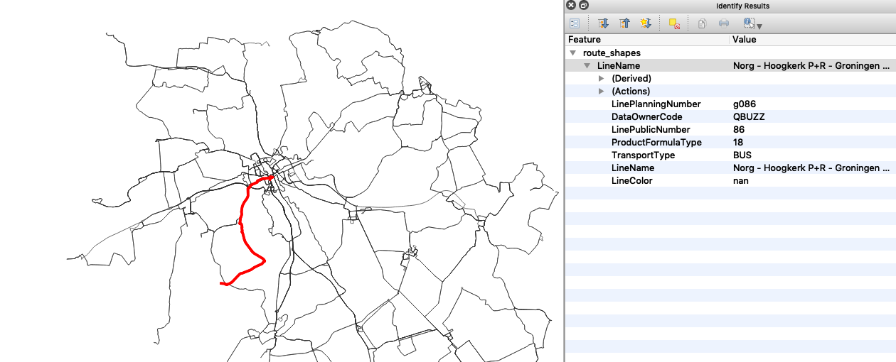

# KV1-route-shapes

This script allows you to generate a GeoJSON with the public transport lines from a Dutch [Koppelvlak 1](http://bison.connekt.nl/standaarden/) schedule. 

### Getting it running
Install the dependencies using `pip install -r requirements.txt`. Run the script from the directory containing the Koppelvlak 1 files. 

### Example output

